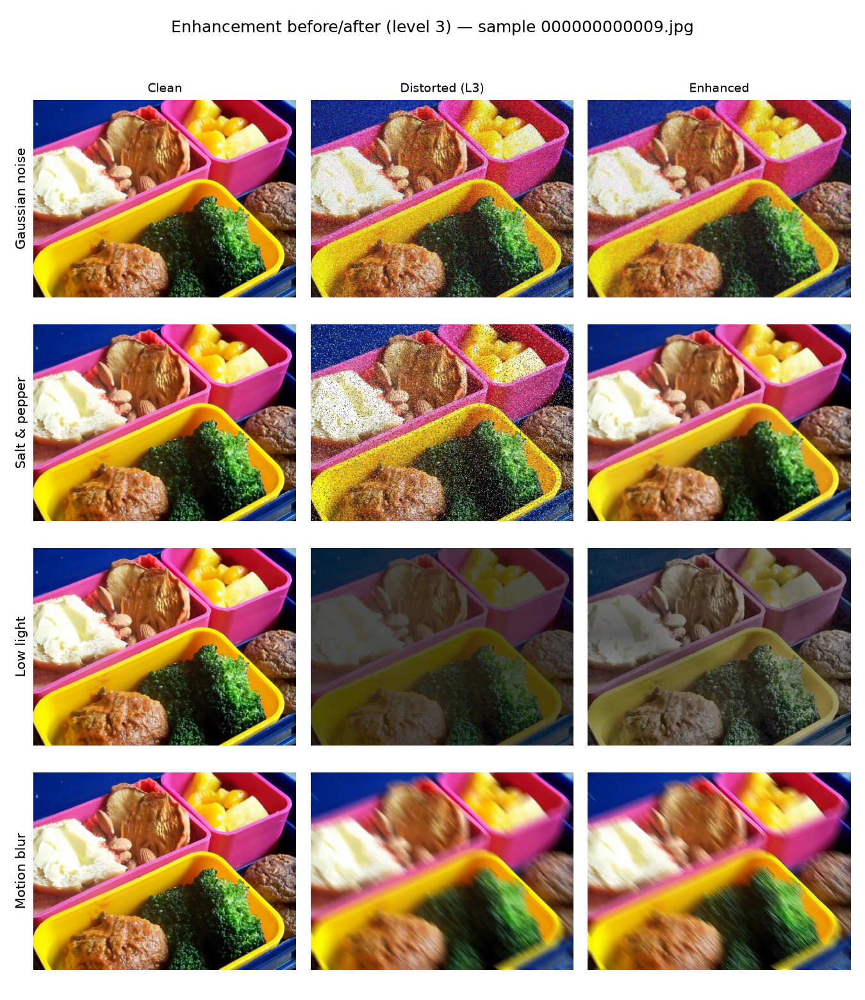
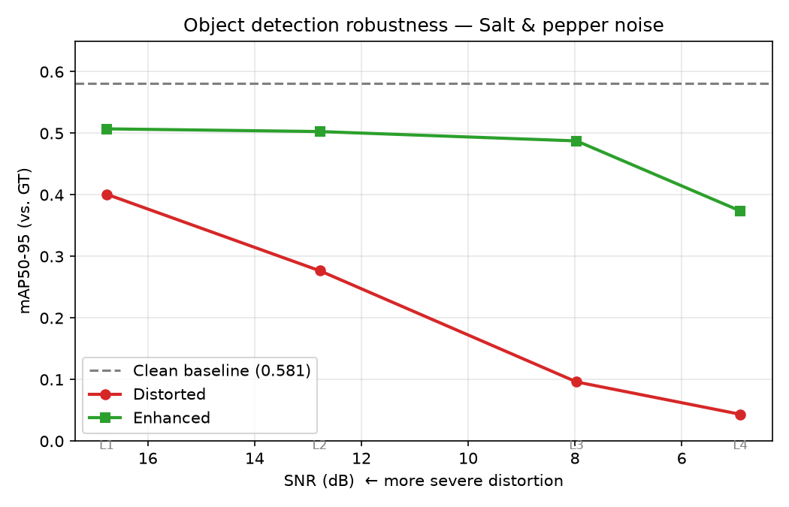
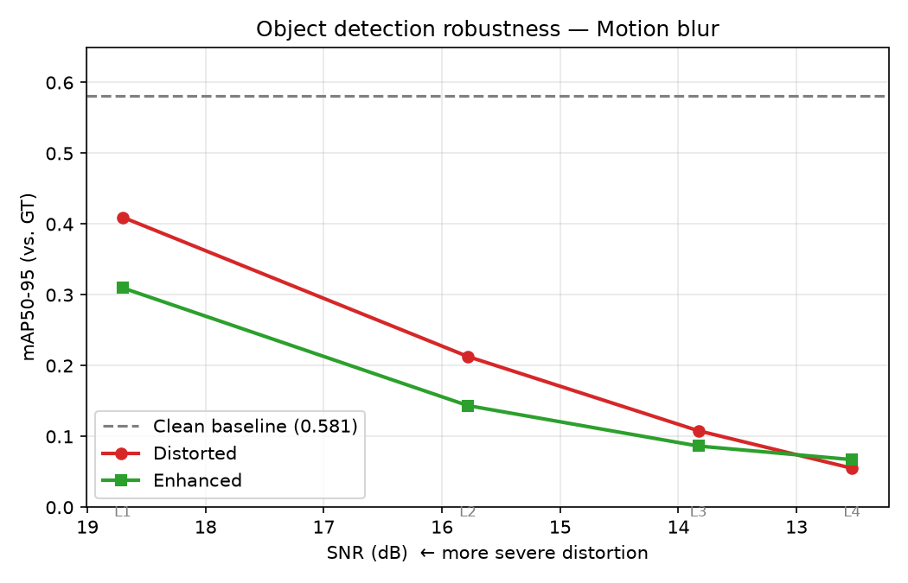
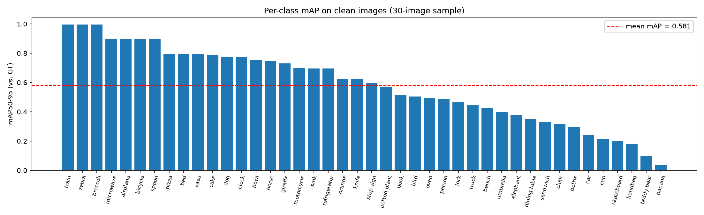
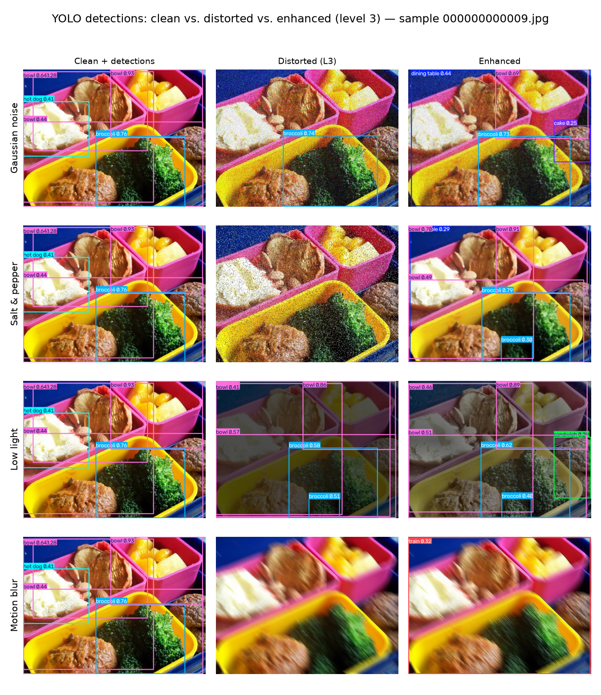

# Robustness of Classical and Deep Vision Methods under Image Processing Degradations

**Image Processing & Computer Vision — Course Project**
Team:  Nitzan Sharabi · Roni Volshtein · Matan Sela

This project studies how four classical image degradations — Gaussian noise, salt & pepper noise, low light, and motion blur — each applied at four severity levels, affect four computer-vision tasks: object detection, instance segmentation, template matching, and sparse optical flow. We then compare two recovery strategies: **classical image-processing enhancement** (preprocessing with course tools: smoothing, median filtering, CLAHE, sharpening) and **fine-tuning** a deep model on distorted data. All experiments use COCO128 / COCO128-Seg as compact public benchmarks with Ground Truth, and performance is measured both with task activity metrics and with **GT-based mAP, per class and per SNR**.


## 1. Project decisions

As a team of 3, per the course rules we use **4 distortions and 4 tasks** (instead of 3 and 3).

| Component | Choice | Rationale |
|---|---|---|
| Dataset | [COCO128](https://github.com/ultralytics/yolov5/releases/download/v1.0/coco128.zip) + COCO128-Seg | Small, public, GT for detection and segmentation, feasible on CPU |
| Distortions (4) | Gaussian noise · Salt & pepper · Low light · Motion blur | All geometry-preserving → the original GT annotations remain valid for distorted images |
| Tasks (4) | Object detection (DL) · Instance segmentation (DL) · Template matching (classical) · Sparse optical flow (classical) | Mix of high-level and low-level tasks; includes DL models as required |
| Models / algorithms | YOLOv8n · YOLOv8n-seg · `cv2.matchTemplate` (NCC) · Shi-Tomasi + pyramidal Lucas-Kanade | Pretrained nano models run on weak hardware; classical methods straight from the course material |
| Enhancement per distortion | Gaussian filter · Median filter · CLAHE · Unsharp sharpening | Each classical tool matched to the degradation it targets in theory |
| Recovery strategies (2) | (a) Enhancement preprocessing · (b) YOLO fine-tuning on distorted data | The two improvement approaches required by the project spec |

## 2. Distortions, severity, and SNR

Each distortion is applied at 4 severity levels. Severity is quantified as the mean **SNR in dB** vs. the clean image, SNR = 10·log₁₀(P_signal / P_noise), measured over the 30-image sample:

| Distortion | Level parameters (L1 → L4) | Mean SNR dB (L1 → L4) | Matched enhancement |
|---|---|---|---|
| Gaussian noise | σ = 15 / 30 / 50 / 75 | 22.1 → 16.6 → 12.6 → 9.7 | Gaussian blur |
| Salt & pepper | density = 2% / 5% / 15% / 30% | 16.8 → 12.8 → 8.0 → 4.9 | Median filter |
| Low light | scale 0.7→0.15 with gamma 0.8→0.3 | 12.1 → 7.6 → 4.2 → 2.0 | CLAHE |
| Motion blur | kernel = 5 / 11 / 21 / 35 px | 18.7 → 15.8 → 13.8 → 12.5 | Sharpening (unsharp) |


*Figure 1 — one sample image under each distortion at all four severity levels, labeled with per-image SNR. Note that motion blur costs relatively few dB yet damages detection the most (6): SNR measures pixel-level damage, not semantic damage.*


*Figure 2 — clean vs. distorted (level 3) vs. enhanced, per distortion. The median filter visibly restores the salt & pepper image; the sharpened motion-blur image remains smeared.*

Per-image annotated outputs for every distortion, level, and task are saved under `data/tasks_applied_on_distorted/` and `data/tasks_applied_on_enhanced/` (regenerated locally by the pipeline — see 8).
## 3. Experimental protocol

Experiments run on the first 30 images of COCO128 (compute constraints; consistent with the course guidance that small-scale evaluation is acceptable). The pipeline:

1. **Baseline** — all 4 tasks on the clean images.
2. **Distortion** — 4 distortions × 4 levels → 480 distorted images; all 4 tasks re-run on each.
3. **Enhancement** — the matched classical enhancement applied to every distorted image → 480 enhanced images; all 4 tasks re-run.
4. **Fine-tuning** — YOLOv8n fine-tuned briefly on distorted images, with the train/test split done **by original image** so that distorted versions of the same image never appear in both sets; re-evaluated on distorted images (object detection only).
5. **Measurement** — two complementary layers:
   (a) per-image task activity metrics, centralized in `metadata_summary_base.csv`;
   (b) **GT-based mAP per class and per SNR** (`map_summary.csv`), described in 5.

## 4. Results — task activity metrics (all 4 tasks)

Mean of each task's primary metric over the 30-image sample (distorted/enhanced values averaged over all distortions and levels; full breakdowns are in `metadata_summary_base.csv` and the plots listed below):

| Task | Metric | Clean | Distorted | Enhanced | Fine-tuned |
|---|---|---|---|---|---|
| Object detection | detected objects | 3.17 | 1.78 | 2.22 | 3.05 |
| Instance segmentation | segmented instances | 3.30 | 1.85 | 2.29 | — |
| Template matching | matching score (NCC) | 1.00 | 0.80 | 0.87 | — |
| Optical flow | tracked points | 187.1 | **194.7** | 189.5 | — |
Fine-tuning applies only to object detection: template matching and optical flow are classical algorithms with no trainable weights, and fine-tuning was scoped to the single GT-evaluated task (see section 5).

Fine-tuning recovery for object detection, per distortion (mean detected objects):

| Distortion | Distorted | Enhanced | Fine-tuned |
|---|---|---|---|
| Gaussian noise | 1.78 | 2.03 | 2.81 |
| Salt & pepper | 1.69 | 2.84 | 2.51 |
| Low light | 2.47 | 2.95 | **4.58** |
| Motion blur | 1.17 | 1.07 | 2.32 |

Note also: on *clean* images the fine-tuned model detects 5.57 objects on average vs. 3.17 for the pretrained model — a 75% inflation in detection count that previews finding 4 below.

Two values are bolded because they are *warnings*, not wins — see finding 3 in 6: optical flow tracking **more** points on distorted images, and the fine-tuned model detecting **more** objects on low-light images than the baseline detects on clean ones, are both artifacts of metrics that never consult the Ground Truth.

Plots: `{task}_vs_level.png`, `{task}_vs_snr.png` (degradation), `{task}_enhancement_recovery_*.png`, `finetune_recovery_*.png` (recovery) — all in `data/tasks_graphs_and_tables/plots/`.

## 5. Results — GT-based accuracy (mAP per class, per SNR)

Activity metrics show trends but cannot verify correctness. We therefore additionally evaluate object detection **against Ground Truth**: since all four distortions are geometry-preserving, the original COCO labels remain a valid answer key for every distorted and enhanced image. Script: `src/evaluate_map_gt.py`; results: `data/tasks_graphs_and_tables/map_summary.csv` (1,419 rows — overall + per-class, for 33 conditions: clean, 16 distorted, 16 enhanced).
Per the project definition, GT-based accuracy evaluation is required for one task; we selected object detection as the GT-evaluated task, with the activity metrics of 4 covering all four tasks.

**Clean baseline on the 30-image sample: mAP50-95 = 0.581.** (On the full 128-image set the pretrained model scores 0.376 — the 30-image sample is an easier draw. All comparisons below use the same 30 images, so they are apples-to-apples.)

| Distortion | Distorted mAP50-95 (L1→L4) | Enhanced mAP50-95 (L1→L4) | Verdict |
|---|---|---|---|
| Salt & pepper | 0.40 → 0.28 → 0.10 → 0.04 | 0.51 → 0.50 → 0.49 → 0.37 | Median filter: near-full recovery even at severe levels |
| Low light | 0.58 → 0.56 → 0.49 → 0.33 | 0.58 → 0.55 → 0.54 → 0.43 | CLAHE matters exactly where the damage is (severe levels) |
| Gaussian noise | 0.46 → 0.31 → 0.16 → 0.06 | 0.49 → 0.38 → 0.26 → 0.14 | Moderate, consistent recovery |
| Motion blur | 0.41 → 0.21 → 0.11 → 0.06 | 0.31 → 0.14 → 0.09 → 0.07 | **Sharpening hurts — negative result (6.2)** |

Plots (`data/tasks_graphs_and_tables/plots/`): `map_curve_gaussian_noise.png`, `map_curve_salt_pepper.png`, `map_curve_low_light.png`, `map_curve_motion_blur.png` — mAP vs. SNR with the clean baseline as reference; `map_per_class_clean.png`, `map_per_class_drop.png` — per-class analysis.



*Figure 3 — the two extremes: near-full recovery by the median filter (top) vs. sharpening that performs worse than no processing (bottom). Gaussian-noise and low-light curves are linked above.*

### Per-class sensitivity

Large, high-contrast classes (train, zebra, airplane) retain accuracy under distortion, while small or low-contrast classes (teddy bear, handbag, banana) collapse first. Two honest caveats: per-class values for rare classes (≤2 images in the sample) are indicative only, and isolated inversions (e.g. *bottle* scoring higher distorted than clean) reflect per-class sample size rather than genuine robustness gains.



## 6. Key findings

1. **Recovery is distortion-dependent and matches theory.** The median filter vs. impulse noise is the textbook pairing and delivers near-full recovery (0.10 → 0.49 at level 3); CLAHE recovers low light mainly at severe levels; Gaussian smoothing trades noise for detail and recovers moderately.
2. **Negative result — sharpening under motion blur.** Unsharp masking makes detection *worse* than no processing at mild-to-moderate blur (mAP 0.41 → 0.31 at level 1). Motion blur smears information along a direction; sharpening cannot un-smear it and instead amplifies the smeared edges, feeding the detector confident wrong gradients. Genuine recovery would require deconvolution-style deblurring.
3. **Metrics that ignore GT overestimate (or invert) reality.** Three concrete cases from our own data: (a) enhanced salt-&-pepper images produce *more* detections than clean images, yet their GT mAP stays below the clean baseline; (b) optical flow tracks *more* points on distorted images (194.7 vs. 187.1) because noise manufactures fake corners for Shi-Tomasi; (c) the fine-tuned model "detects" 4.58 objects on low-light images vs. 3.17 clean. Detection counts measure activity, mAP measures correctness — a robustness study needs the latter.

*Figure 4 — YOLO detections at level 3. Salt & pepper: detections vanish and return after median filtering. Motion blur: sharpening fails to restore them. Gaussian noise: enhancement restores detection activity, but some returned boxes are low-confidence misclassifications ("dining table", "cake") — activity without correctness.*
4. **Fine-tuning vs. enhancement — the GT verdict.** Evaluated on 10 COCO128 images outside the pipeline's 30 (unseen by the fine-tuned model by construction; `map_summary_finetuned.csv`), fine-tuning yields modest real gains on noise distortions (mAP50-95 +0.03-0.06 on salt & pepper and Gaussian noise), **no measurable gain on low light or motion blur**, and a slight cost on clean images (0.396 → 0.378 — mild catastrophic forgetting from the short adaptation). This contradicts the counting-based picture (e.g. "+99% recovery on motion blur"), which finding 3 explains: the fine-tuned model simply fires far more boxes (5.57 vs. 3.17 detections on clean images). Conclusion: at this training scale, a matched classical enhancement (e.g. median filtering for impulse noise) recovers far more accuracy than fine-tuning, at zero training cost; fine-tuning's counting-metric advantage was largely over-detection.

## 7. Limitations

- 30-image sample (compute limits): per-class numbers are noisy for rare classes.
- Fine-tuning is a short, small-scale adaptation experiment (few epochs, nano model, detection only) — not a state-of-the-art claim.
- GT-based mAP currently covers object detection; extending it to segmentation mask-mAP is a natural next step.
- Motion blur lacks a genuine deblurring baseline (see 9).

## 8. Reproducing the results

### Environment setup

```bash
# Windows
python -m venv venv
.\venv\Scripts\activate
pip install -r requirements.txt

# Download YOLO weights + coco128 and sanity-check the base models
python main.py
```

**Dataset path:** the scripts look for `coco128/images/train2017` in this order: a hardcoded Windows path, a hardcoded Linux path, then `datasets/coco128/images/train2017` relative to the project root. If none exist on your machine, download [coco128](https://github.com/ultralytics/yolov5/releases/download/v1.0/coco128.zip) and place it under `datasets/` in the project root. Note: ultralytics may download the dataset to a `datasets/` folder in the *parent* directory; if the classical experiments then fail with "Image not found", copy it into the project root (`Copy-Item -Recurse <parent>\datasets .\datasets`).

### Pipeline — run in this order

Each stage reads from and appends to one shared file, **`data/tasks_graphs_and_tables/metadata_summary_base.csv`**. Every task result is one row; the `model_type` column (`Baseline` / `Fine-Tuned` / `Enhanced`) marks which stage produced it.

```bash
# Stage 1 — baseline & distortions (30 images × 4 distortions × 4 levels × 4 tasks)
python src/run_30_pic_dataset.py
python validate_pipeline.py          # optional: validates CSV structure and folders
python src/generate_plots.py         # per-task degradation charts

# Stage 2, track A — YOLO fine-tuning
python src/prepare_yolo_dataset.py
python src/train_yolo.py
python src/evaluate_finetuned.py
python src/plot_finetune_results.py

# Stage 2, track B — classical enhancement
python src/apply_enhancements.py
python src/evaluate_enhancements.py
python src/plot_enhancement_results.py

# Stage 3 — GT-based mAP evaluation and plots (this report 5)
python src/evaluate_map_gt.py
python src/plot_map_results.py
```

The distortion→enhancement mapping is defined once, in `src/enhancements.py` (`ENHANCEMENT_FOR_DISTORTION`).

### Data & output layout

```
data/
├── distorted_images/               (480 distorted images: 30 × 4 distortions × 4 levels)
├── enhanced_images/                (same 480 after the matched enhancement)
├── tasks_applied_on_distorted/     (annotated task outputs, {task}/{distortion}_l{level}/)
├── tasks_applied_on_enhanced/      (same layout, on enhanced images)
└── tasks_graphs_and_tables/
    ├── metadata_summary_base.csv   (central activity-metrics table)
    ├── map_summary.csv             (GT-based mAP: condition/class/SNR — 5)
    └── plots/                      (all comparison charts)
```

Image folders are gitignored (regenerate by running the pipeline); both CSVs and all plots are committed.

### File reference

| File | Purpose |
|---|---|
| `src/distortions.py` | The 4 distortion functions + SNR calculation |
| `src/enhancements.py` | Enhancement functions + distortion→enhancement map |
| `src/classical_tasks.py` / `src/yolo_tasks.py` | Task implementations |
| `src/run_classical_experiments.py` / `src/run_dl_experiments.py` | Pure per-task evaluation functions |
| `src/run_30_pic_dataset.py` | Stage 1 main runner |
| `src/prepare_yolo_dataset.py`, `src/train_yolo.py`, `src/evaluate_finetuned.py` | Fine-tuning track |
| `src/apply_enhancements.py`, `src/evaluate_enhancements.py` | Enhancement track |
| `src/evaluate_map_gt.py` | **GT-based mAP per class / per SNR (5)** |
| `src/generate_plots.py`, `src/plot_finetune_results.py`, `src/plot_enhancement_results.py`, `src/plot_map_results.py` | All charts |
| `validate_pipeline.py` | Output validation |
| `appendices/` | Legacy/unused scripts kept for reference |

### Troubleshooting

- **"Dataset directory not found"** — see the dataset path note above.
- **`ModuleNotFoundError` for local imports** — run scripts from the project root (`python src/script.py`), not from inside `src/`.
- **YOLO models not downloading** — check connectivity; `python main.py` downloads `yolov8n.pt` / `yolov8n-seg.pt` on first run.
- **Enhanced image not found** — run `apply_enhancements.py` before `evaluate_enhancements.py`.

## 9. Possible extensions

The project's scope is complete as defined; the findings above suggest two directions for anyone wishing to extend it. First, the negative result on motion blur (6.2) indicates that recovery for this distortion lies beyond edge amplification — an extension could examine genuine deblurring methods (e.g., Wiener or Richardson-Lucy deconvolution, particularly convenient here since the blur kernel is known by construction) and test whether they achieve what sharpening could not. Second, running the evaluation on the full 128-image set rather than the 30-image sample would tighten the per-class statistics presented in 5.