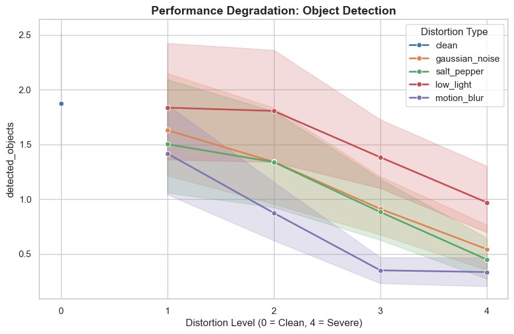
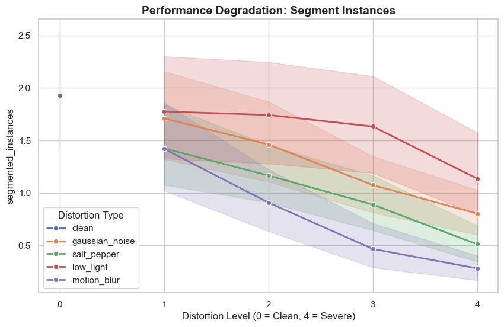
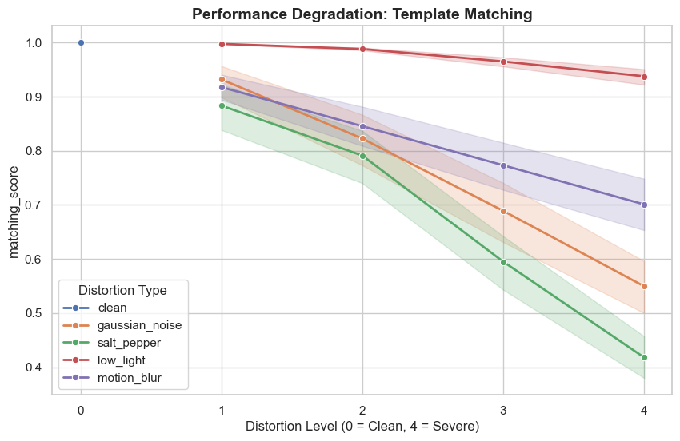
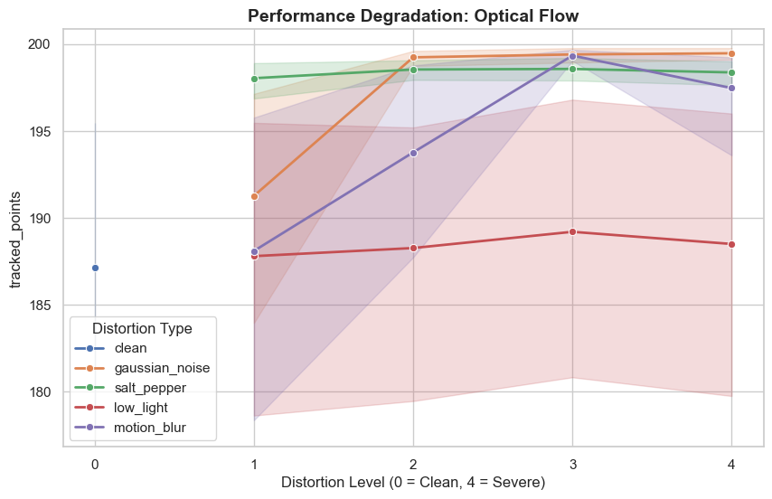
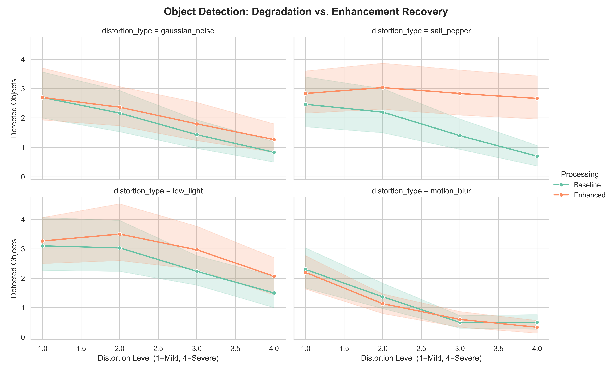
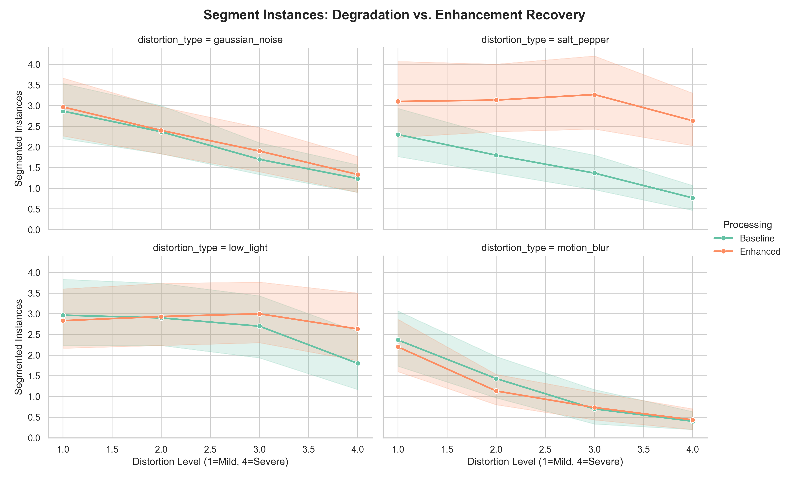
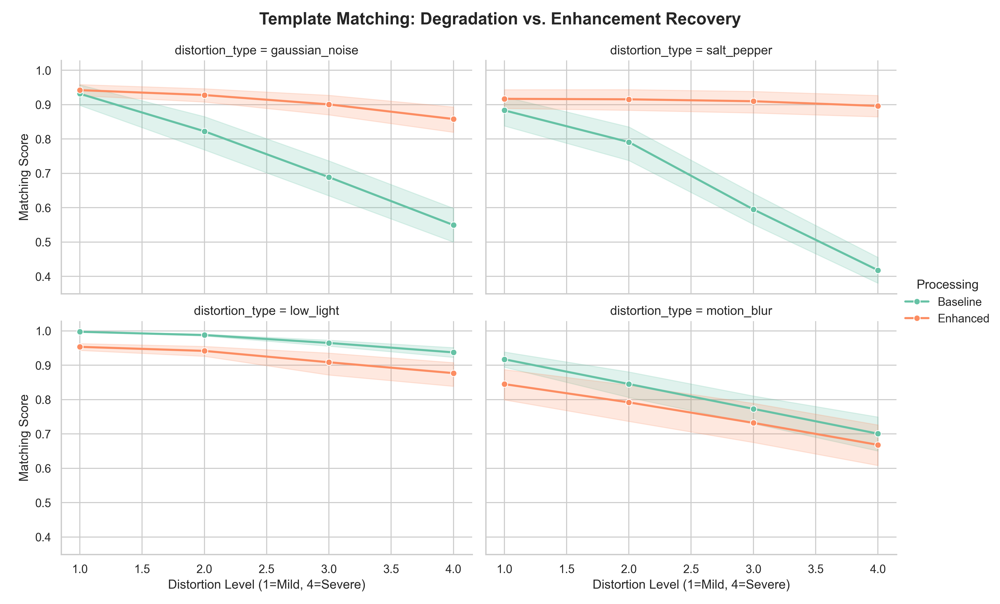
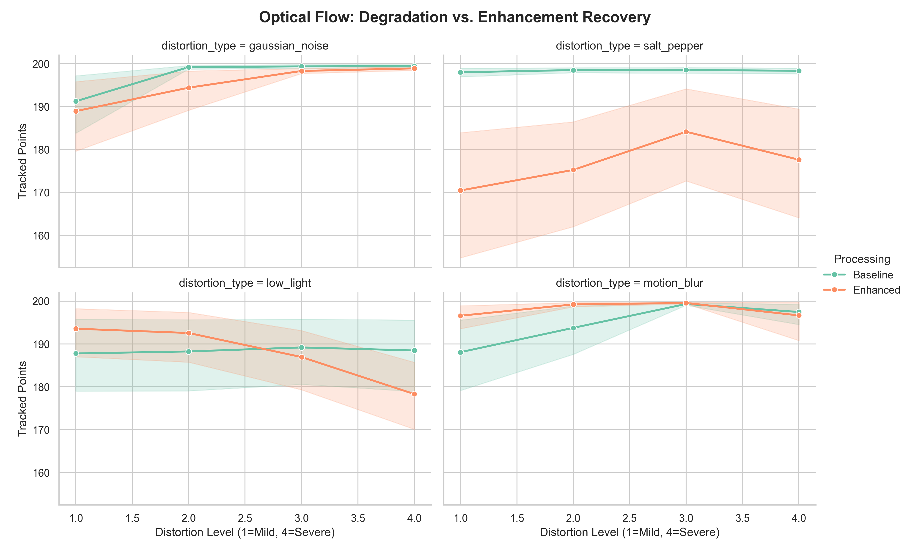
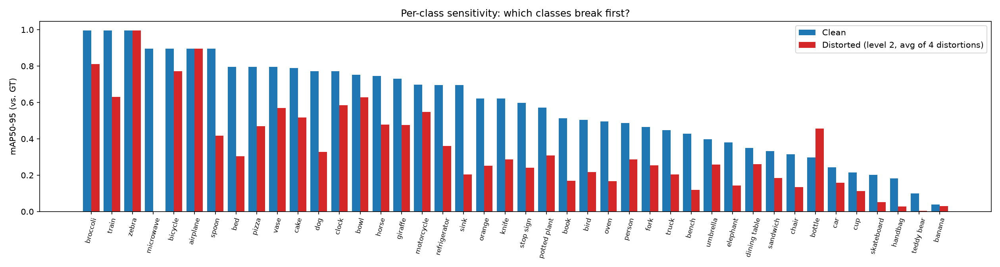

# Robustness of Classical and Deep Vision Methods under Image Processing Degradations

**Image Processing & Computer Vision — Course Project**  
Team: Nitzan Sharabi · Roni Volshtein · Matan Sela

## Project question

Computer-vision methods are usually demonstrated on clean images, while real cameras produce noise, poor lighting and motion blur. This project examines:

> How do classical and deep vision tasks behave as image quality deteriorates, and how much of the lost performance can be recovered through classical preprocessing or model adaptation?

We first explore four different tasks using task-specific **activity metrics**. We then use object detection as the rigorous Ground-Truth case study, measuring box mAP per class and per SNR. This distinction is important: an algorithm can produce more outputs without producing more correct outputs.

The experiment contains:

- **1 public dataset:** COCO128 / COCO128-Seg
- **4 vision tasks:** object detection, instance segmentation, template matching and sparse optical flow
- **4 distortions:** Gaussian noise, salt-and-pepper noise, low light and motion blur
- **4 severity levels per distortion**, quantified using SNR
- **2 recovery approaches:** matched classical enhancement and small-scale object-detector fine-tuning

## Contents

1. [Experimental choices](#1-experimental-choices)
2. [How each task is used](#2-how-each-task-is-used)
3. [Distortions, severity and recovery methods](#3-distortions-severity-and-recovery-methods)
4. [Chronological experimental protocol](#4-chronological-experimental-protocol)
5. [Stage 1 — clean baseline](#5-stage-1--clean-baseline)
6. [Stage 2 — behavior under distortion](#6-stage-2--behavior-under-distortion)
7. [Stage 3 — recovery through enhancement](#7-stage-3--recovery-through-enhancement)
8. [Stage 4 — Ground-Truth object-detection evaluation](#8-stage-4--ground-truth-object-detection-evaluation)
9. [Stage 5 — object-detection fine-tuning](#9-stage-5--object-detection-fine-tuning)
10. [Conclusions](#10-conclusions)
11. [Limitations](#11-limitations)
12. [Reproducing and inspecting the results](#12-reproducing-and-inspecting-the-results)
13. [File reference](#13-file-reference)
14. [Possible extensions](#14-possible-extensions)

---

## 1. Experimental choices

As a team of three, we used four tasks and four distortions. This exceeds the minimum requirement of three tasks and three distortions.

| Component | Choice | Why we selected it |
|---|---|---|
| Dataset | [COCO128](https://github.com/ultralytics/yolov5/releases/download/v1.0/coco128.zip) + COCO128-Seg | Small and public, includes object annotations, and is practical on limited hardware |
| Tasks | Object detection · Instance segmentation · Template matching · Sparse optical flow | Covers high-level and low-level vision, classical algorithms and deep models |
| DL models | YOLOv8n · YOLOv8n-seg | Pretrained nano models are computationally practical while providing realistic detection and segmentation outputs |
| Classical methods | Normalized cross-correlation · Shi–Tomasi corners + pyramidal Lucas–Kanade | Standard, interpretable image-processing methods covered by the course |
| Distortions | Gaussian noise · Salt and pepper · Low light · Motion blur | Common camera/image degradations that preserve the original object locations |
| Enhancements | Gaussian smoothing · Median filtering · CLAHE · Unsharp masking | Each method was selected as a theoretically relevant response to its paired distortion |
| Fine-tuning | YOLOv8n object detection only | Object detection was selected as the project's Ground-Truth-evaluated task; segmentation remained pretrained |

All four distortions preserve image geometry. Therefore, the original COCO bounding boxes remain valid for clean, distorted and enhanced versions of the same image.

---

## 2. How each task is used

The tasks answer different robustness questions and should not be interpreted as if they share one universal metric.

| Task | Method | What we check under distortion | Recorded activity metric | GT metric in this project |
|---|---|---|---|---|
| Object detection | YOLOv8n | Whether known objects continue to be detected as appearance deteriorates | Number of detections and average confidence | Box mAP50 and mAP50–95, overall and per class |
| Instance segmentation | YOLOv8n-seg | Whether the pretrained model continues to produce object instances under degradation | Number of segmented instances and average confidence | Not included in the main GT study |
| Template matching | `cv2.matchTemplate` using normalized cross-correlation | **How much the match to a known template is preserved under different distortions** | Maximum NCC matching score | No separate external GT metric was defined |
| Sparse optical flow | Shi–Tomasi + pyramidal Lucas–Kanade | Whether points detected in the first frame can still be tracked in the degraded frame pair | Number of successfully tracked points | No endpoint-error GT was defined |

The activity metrics allow the same broad pipeline to cover all four tasks, but they do not always represent correctness. For example, noise can create additional corners, increasing the optical-flow tracked-point count even when the image is worse. This observation motivated the additional GT-based evaluation for object detection.

---

## 3. Distortions, severity and recovery methods

Each distortion was applied at four severity levels. We quantify the actual pixel change using

**SNR = 10·log₁₀(P_signal / P_noise)**.

The reported SNR values are averages over the 30-image main sample.

| Distortion | Level parameters, L1 → L4 | Mean SNR, L1 → L4 | Paired enhancement | Intended role of enhancement |
|---|---|---|---|---|
| Gaussian noise | σ = 15 / 30 / 50 / 75 | 22.1 → 16.6 → 12.6 → 9.7 dB | Gaussian smoothing | Suppress additive high-frequency noise, accepting some loss of detail |
| Salt and pepper | density = 2% / 5% / 15% / 30% | 16.8 → 12.8 → 8.0 → 4.9 dB | Median filter | Remove isolated impulse pixels while preserving edges |
| Low light | scale 0.7 → 0.15 with gamma 0.8 → 0.3 | 12.1 → 7.6 → 4.2 → 2.0 dB | CLAHE | Restore local contrast without applying one global amplification factor |
| Motion blur | kernel = 5 / 11 / 21 / 35 px | 18.7 → 15.8 → 13.8 → 12.5 dB | Unsharp masking | Test whether edge amplification can recover detector activity after blur |


*Figure 1 — A clean sample and all four severity levels for every distortion. The labels show per-image SNR. Motion blur illustrates an important limitation of SNR: relatively modest pixel error can still destroy semantically important edges.*

---

## 4. Chronological experimental protocol

The main experiment proceeds in the following order:

1. **Select 30 clean COCO128 images** and retain their original annotations.
2. **Clean baseline:** run all four tasks on every clean image.
3. **Distortion:** generate 4 distortions × 4 levels for every image, producing 480 distorted images, and rerun all tasks.
4. **Enhancement:** apply the paired enhancement to every distorted image, producing 480 enhanced images, and rerun all tasks.
5. **Activity analysis:** compare clean, distorted and enhanced task-specific outputs using the central CSV.
6. **GT detection analysis:** validate YOLO predictions against the original COCO boxes and compute mAP per condition, class and SNR.
7. **Fine-tuning extension:** compare pretrained and fine-tuned YOLOv8n detection on 10 additional COCO128 images outside the main 30-image sample.
8. **Interpretation:** compare the activity story with the Ground-Truth story and document where they disagree.

The central activity table is `data/tasks_graphs_and_tables/metadata_summary_base.csv`. It contains 7,950 rows:

| Model stage | Rows |
|---|---:|
| Baseline | 3,570 |
| Enhanced | 3,360 |
| Fine-Tuned detection activity | 1,020 |

GT-based results are stored separately because mAP is aggregated by condition and class:

- `map_summary.csv`: pretrained clean/distorted/enhanced detection results
- `map_summary_finetuned.csv`: pretrained versus fine-tuned detection on the additional 10-image sample

---

## 5. Stage 1 — clean baseline

The clean baseline establishes what each method produces before image quality is changed.

| Task | Primary activity metric | Clean mean |
|---|---|---:|
| Object detection | Detected objects | 3.17 |
| Instance segmentation | Segmented instances | 3.30 |
| Template matching | NCC matching score | 1.00 |
| Sparse optical flow | Tracked points | 187.1 |

For object detection, which is evaluated against GT, the pretrained model obtained:

- **mAP50–95 = 0.581** on the 30-image main sample
- **mAP50–95 = 0.376** on the complete 128-image clean dataset

The 30-image sample is therefore an easier draw than the full dataset. All clean/distorted/enhanced comparisons in the main GT experiment use the same 30 images, keeping those comparisons internally consistent.


*Figure 2 — Clean detection mAP50–95 per class. Large or visually distinctive objects often begin with high accuracy, while results for rare classes in a 30-image sample are statistically unstable.*

---

## 6. Stage 2 — behavior under distortion

### 6.1 Object detection and instance segmentation



*Figure 3 — Mean number of detected objects versus severity. Motion blur causes the quickest activity collapse; Gaussian and impulse noise decline steadily; low light retains more detections until the severe levels.*

Object-detection activity falls from 3.17 objects on clean images to an average of 1.78 across distorted conditions. Motion blur is especially damaging even though its SNR remains relatively high. This shows that pixel-level SNR alone does not determine task-level damage: directional blur removes edges and texture cues used by the detector.



*Figure 4 — The pretrained segmentation model follows a similar degradation pattern. Motion blur produces the steepest drop in segmented instances, while low light is comparatively tolerable until higher severity.*

Instance segmentation falls from 3.30 segmented instances on clean images to 1.85 on average under distortion. These counts demonstrate reduced model activity, but without mask GT they do not establish whether the remaining masks are accurate.

### 6.2 Template matching



*Figure 5 — Preservation of the match to the known clean template. Low light retains a high normalized correlation, whereas salt-and-pepper and Gaussian noise progressively destroy the local intensity pattern.*

The template is cropped from the clean image and used as the known reference. The experiment asks how much that known match survives when the target image is distorted. The clean match is 1.00 by construction. At level 4:

- Low light remains near 0.94 because normalized correlation is relatively tolerant of broad intensity changes.
- Motion blur remains around 0.70: the structure is weakened but still recognizable.
- Gaussian noise drops to roughly 0.55.
- Salt-and-pepper noise falls to roughly 0.42, the strongest disruption of the template's pixel structure.

This result differs from object detection: low light is damaging to learned semantic inference at severe levels, yet normalized template correlation remains high because it compensates for overall intensity scaling.

### 6.3 Sparse optical flow and the metric problem



*Figure 6 — Tracked-point count often rises above the clean baseline. This is not an accuracy improvement: noise and distorted edges can create additional Shi–Tomasi corner candidates.*

The mean tracked-point count is 187.1 on clean images but 194.7 across distorted conditions. Taken literally, that would imply that degradation improves optical flow. Visual reasoning gives the opposite explanation: noise manufactures high-frequency corner-like structures, and the count metric never checks whether those tracks correspond to correct physical motion.

This is the clearest example of why the project separates **activity metrics** from **correctness metrics**.

---

## 7. Stage 3 — recovery through enhancement

Every distorted image is processed with the enhancement paired to its distortion, and all four tasks are rerun.


*Figure 7 — Clean, distorted and enhanced examples at level 3. Median filtering visibly removes impulse pixels; CLAHE recovers local contrast; smoothing reduces Gaussian noise but also detail; sharpening cannot undo directional motion smear.*

Mean task activity across all distortions and levels:

| Task | Clean | Distorted | Enhanced | Interpretation |
|---|---:|---:|---:|---|
| Object detection — detected objects | 3.17 | 1.78 | 2.22 | Enhancement restores part of the lost detector activity |
| Instance segmentation — segmented instances | 3.30 | 1.85 | 2.29 | Similar partial recovery for the pretrained segmentation model |
| Template matching — NCC | 1.00 | 0.80 | 0.87 | Paired preprocessing improves average template similarity |
| Optical flow — tracked points | 187.1 | 194.7 | 189.5 | The value moves toward baseline, but count is not an accuracy measure |

The object-detection recovery depends strongly on the distortion:

| Distortion | Distorted detections | Enhanced detections | Main observation |
|---|---:|---:|---|
| Gaussian noise | 1.78 | 2.03 | Moderate recovery after smoothing |
| Salt and pepper | 1.69 | 2.84 | Strong recovery after median filtering |
| Low light | 2.47 | 2.95 | CLAHE helps, especially at severe levels |
| Motion blur | 1.17 | 1.07 | Sharpening does not restore the lost information |



*Figure 8 — Detection activity before and after enhancement by distortion and severity. In this and the following recovery plots, “Baseline” means the distorted image before enhancement, not the clean-image baseline. The improvement is method-dependent rather than universal.*

### 7.1 Object-detection recovery

The detector shows three different types of enhancement behavior:

- **Strong recovery under salt-and-pepper noise:** median filtering produces a large and persistent separation from the distorted curve. At levels 3 and 4, detection activity remains near 2.8 and 2.7 objects after enhancement, while the unprocessed distorted images fall to roughly 1.4 and 0.7.
- **Moderate recovery under Gaussian noise:** smoothing helps at every severity, but the enhanced curve still declines as variance increases. Suppressing noise also removes some detail, so the method cannot return the detector to its clean baseline.
- **Severity-dependent recovery under low light:** CLAHE helps most clearly from level 2 onward, where local contrast restoration preserves more detectable objects.
- **No recovery under motion blur:** sharpening is slightly worse at mild and moderate levels and only approximately equal at level 3. Edge amplification cannot reconstruct the directionally smeared information.

These counts describe detector activity. The GT evaluation in Stage 4 verifies which recovered boxes are correct.

### 7.2 Instance-segmentation recovery



*Figure 9 — Number of segmented instances before and after paired enhancement. “Baseline” denotes the distorted, unenhanced condition. The median filter produces the largest recovery; sharpening provides almost none.*

The pretrained segmentation model follows patterns similar to object detection, which is reasonable because both YOLO tasks depend on semantic features and identifiable object boundaries:

- **Gaussian noise:** Gaussian smoothing provides a small, consistent increase in segmented-instance count. The curves remain close because smoothing removes both noise and some boundary detail.
- **Salt-and-pepper noise:** median filtering produces the strongest segmentation recovery. The enhanced model retains roughly 2.6–3.3 segmented instances across all levels, while the distorted curve falls from about 2.3 to 0.8.
- **Low light:** CLAHE has limited effect at mild levels but becomes useful at severe darkness. At level 4, the enhanced images produce about 2.6 instances compared with about 1.8 before enhancement.
- **Motion blur:** sharpening does not restore segmentation activity and is slightly worse at the first two levels. The two curves converge only after both have already collapsed.

This agreement between detection and segmentation supports a common qualitative conclusion: impulse-noise removal and severe-low-light contrast restoration help the pretrained deep models, while unsharp masking is not a solution to motion blur. However, segmented-instance count is still only an activity metric. A rigorous segmentation conclusion would require mask IoU or mask mAP against COCO segmentation GT.

### 7.3 Template-matching recovery



*Figure 10 — NCC similarity to the known clean template before and after enhancement. Gaussian and median filtering preserve the match strongly; CLAHE and sharpening reduce the score relative to leaving their distorted inputs unprocessed.*

Template matching reveals that an enhancement can help one vision task while hurting another:

- **Gaussian noise:** without preprocessing, NCC falls from approximately 0.93 to 0.55. Gaussian smoothing keeps the score between roughly 0.94 and 0.86. The filter suppresses random pixel deviations, so the local pattern again resembles the clean reference.
- **Salt-and-pepper noise:** median filtering almost completely stabilizes the match, keeping NCC near 0.90 across all four levels instead of falling to roughly 0.42. This is one of the clearest demonstrations of a correctly matched enhancement method in the project.
- **Low light:** the distorted images already retain very high NCC because normalized correlation tolerates broad intensity scaling. CLAHE slightly lowers the score at every level by changing the local intensity distribution relative to the original clean template.
- **Motion blur:** sharpening remains below the unprocessed blurred-image curve. It increases local contrast but does not reproduce the original spatial pattern that NCC is trying to match.

This result adds an important qualification to “enhancement recovery.” An image is not enhanced in an absolute task-independent sense. It is transformed in a way that may restore information useful to one method while changing information used by another. Median filtering is beneficial to both deep inference and template similarity under impulse noise; CLAHE can help deep object inference in severe darkness while slightly reducing similarity to a fixed clean template.

### 7.4 Sparse-optical-flow recovery



*Figure 11 — Tracked-point count before and after enhancement. These curves must not be read as accuracy curves: neither line checks the estimated tracks against known physical displacement.*

The optical-flow recovery plot reinforces the metric limitation discovered in the degradation stage:

- **Gaussian noise:** smoothing slightly reduces the number of tracks at mild levels, while both curves approach the algorithm's effective point limit at stronger levels. A high count may include noise-induced features.
- **Salt-and-pepper noise:** the distorted images remain close to 198 tracked points, while median filtering lowers the count to roughly 170–184. This apparent “loss” can actually mean that the filter removed impulse pixels that were incorrectly accepted as corners.
- **Low light:** CLAHE raises the tracked-point count at mild levels but lowers it at severe levels. Without a known motion field, neither direction can be classified as a correctness improvement.
- **Motion blur:** distorted and sharpened images both produce high tracked-point counts, despite motion blur being highly destructive to object detection. Count saturation hides whether individual tracks correspond to real image motion.

For optical flow, enhancement should ultimately be evaluated using synthetic translation or another known transformation. That would make it possible to compute endpoint error, track survival on the same physical points, and the fraction of geometrically correct tracks. The current experiment instead demonstrates how an apparently intuitive activity metric can invert the perceived robustness result.

### 7.5 Cross-task enhancement conclusions

Looking across the four recovery figures produces conclusions that are not visible from the overall averages alone:

1. **Salt-and-pepper plus median filtering is the most consistently successful pair.** It restores detection and segmentation activity, preserves template NCC, and removes many noise-created optical-flow features.
2. **Gaussian smoothing provides partial recovery.** It improves deep-task activity and template similarity, but its unavoidable detail loss prevents complete recovery.
3. **CLAHE is task-dependent.** It helps object detection and segmentation mainly at severe darkness, yet slightly reduces NCC because template matching was defined relative to the original clean intensity pattern.
4. **Unsharp masking does not solve motion blur.** It fails for detection and segmentation, decreases template similarity, and produces ambiguous optical-flow counts.
5. **The meaning of recovery depends on the metric.** A higher detection count, segmentation count or tracked-point count is not automatically a more correct result. Only the GT stage can establish detection correctness.

Detection counts are useful for showing behavior, but a returned box can be incorrect. The next stage checks recovery against the actual COCO annotations.

---

## 8. Stage 4 — Ground-Truth object-detection evaluation

Object detection is the selected rigorous GT case study. Because all distortions preserve geometry, each prediction can be compared with the original COCO bounding boxes using YOLO validation metrics.

`src/evaluate_map_gt.py` evaluates 33 conditions:

- 1 clean condition
- 16 distorted conditions: 4 distortions × 4 levels
- 16 enhanced conditions: 4 distortions × 4 levels

Results are saved overall and per class in `map_summary.csv`.

| Distortion | Distorted mAP50–95, L1 → L4 | Enhanced mAP50–95, L1 → L4 | Conclusion |
|---|---|---|---|
| Salt and pepper | 0.40 → 0.28 → 0.10 → 0.04 | 0.51 → 0.50 → 0.49 → 0.37 | Median filtering provides the strongest recovery |
| Low light | 0.58 → 0.56 → 0.49 → 0.33 | 0.58 → 0.55 → 0.54 → 0.43 | CLAHE matters mainly at severe darkness |
| Gaussian noise | 0.46 → 0.31 → 0.16 → 0.06 | 0.49 → 0.38 → 0.26 → 0.14 | Smoothing provides moderate, consistent recovery |
| Motion blur | 0.41 → 0.21 → 0.11 → 0.06 | 0.31 → 0.14 → 0.09 → 0.07 | Sharpening usually hurts rather than helps |


*Figure 12 — Median filtering substantially restores detection correctness under impulse noise, not merely the number of predictions.*


*Figure 13 — Unsharp masking performs below the unprocessed blurred image at mild and moderate levels. Sharpening amplifies smeared gradients but cannot reconstruct information lost along the blur direction.*


*Figure 14 — Qualitative detection results at level 3. Salt-and-pepper detections disappear and return after median filtering. Motion-blur detections remain largely absent. Gaussian smoothing returns some boxes, including incorrect low-confidence classes—illustrating why count alone is insufficient.*

### Per-class behavior

Large, high-contrast classes such as train, zebra and airplane often retain more accuracy under distortion. Small or low-contrast classes such as teddy bear, handbag and banana collapse earlier. These observations must be interpreted cautiously because some classes appear in only one or two images in the selected sample.



*Figure 15 — Per-class mAP50–95 on clean images and level-2 distorted conditions. Rare-class inversions can reflect small sample size rather than genuine robustness.*

---

## 9. Stage 5 — object-detection fine-tuning

Fine-tuning was scoped to **YOLOv8n object detection only**. The YOLOv8n-seg model remained pretrained and was evaluated only in the clean, distorted and enhanced activity experiments.

Two fine-tuning evaluations appear in the project:

1. `evaluate_finetuned.py` records detection count and confidence on the main experimental conditions.
2. `evaluate_map_finetuned.py` compares pretrained and fine-tuned detection against GT on 10 additional COCO128 images outside the main 30-image sample.

The activity evaluation initially suggested dramatic recovery. For example, the fine-tuned model generated 5.57 detections on clean images versus 3.17 for the pretrained model. This is a warning rather than a clear success: producing 75% more boxes may represent over-detection.

The GT evaluation gives the more reliable interpretation:

- Gaussian and salt-and-pepper noise show real but modest gains, commonly about +0.03 to +0.06 mAP50–95.
- Low light shows no consistent improvement.
- Motion blur shows no consistent improvement, aside from one severe-level increase on the small sample.
- Clean mAP50–95 changes from 0.396 to 0.378, indicating a small clean-performance cost.

Fine-tuning and enhancement were evaluated on different image samples, so they should not be treated as a controlled head-to-head ranking. The evidence shows strong enhancement recovery in the 30-image main experiment and modest fine-tuning gains in the additional 10-image evaluation.

> Reproducibility note: the current repository preserves the fine-tuning result tables and evaluation code, but not the original preparation implementation, exact training manifest or fine-tuned checkpoint. The exact historical split therefore cannot currently be reconstructed from the repository alone.

---

## 10. Conclusions

### 10.1 Distortion severity affects tasks differently

All tasks change as severity increases, but SNR alone does not predict semantic damage. Motion blur retains a comparatively high SNR while rapidly destroying detection and segmentation activity because it removes directional edge information.

### 10.2 The correct enhancement depends on the distortion

Median filtering is the strongest pairing in the experiment because impulse noise consists of isolated extreme pixels. CLAHE helps when darkness becomes severe. Gaussian smoothing provides partial recovery but trades noise reduction for detail loss.

### 10.3 Sharpening is not deblurring

Unsharp masking cannot reverse motion convolution. At mild blur, enhanced detection mAP falls from 0.41 to 0.31. This negative result identifies a better future direction: Wiener or Richardson–Lucy deconvolution using the known synthetic blur kernel.

### 10.4 Activity and correctness can disagree

Three results demonstrate the problem:

1. Optical flow tracks more points under distortion because noise creates false corners.
2. Enhanced images can generate more detection boxes without returning fully to clean-image mAP.
3. Fine-tuning dramatically increases detection count while producing only modest GT-based gains.

The main methodological conclusion is therefore:

> Robustness should be judged using Ground Truth whenever possible. Activity metrics are useful for exploration, but they cannot establish correctness by themselves.

### 10.5 Object detection is the central rigorous case study

All four tasks were run across the pipeline. Object detection was selected for the detailed accuracy study because COCO boxes allow consistent clean/distorted/enhanced comparison per class and per SNR. The other tasks provide supporting behavioral evidence rather than equivalent GT accuracy experiments.

---

## 11. Limitations

- The main experiment uses 30 images because of compute constraints; per-class statistics are noisy for rare classes.
- GT-based robustness evaluation covers object detection. Segmentation mask mAP, optical-flow endpoint error and template-localization error were not evaluated.
- Fine-tuning covers object detection only and represents short, small-scale adaptation rather than an optimized training study.
- Enhancement and fine-tuning were not compared on the same held-out evaluation set.
- The original fine-tuning preparation code, exact split manifest and checkpoint are not currently preserved in the repository.
- The motion-blur recovery method is edge sharpening, not a genuine deconvolution method.

---

## 12. Reproducing and inspecting the results

### Inspecting the committed results

The main report artifacts can be inspected without rerunning the expensive pipeline:

```text
data/tasks_graphs_and_tables/
├── metadata_summary_base.csv
├── map_summary.csv
├── map_summary_finetuned.csv
└── plots/
```

### Environment setup

```powershell
python -m venv venv
.\venv\Scripts\activate
pip install -r requirements.txt
python main.py
```

Download COCO128 and place it under:

```text
datasets/coco128/images/train2017
datasets/coco128/labels/train2017
```

### Main reproducible stages

Run commands from the project root:

```powershell
# 1. Clean baseline and distorted-image experiments
python src/run_30_pic_dataset.py

# 2. Validate the generated structure
$env:PYTHONUTF8 = "1"
python validate_pipeline.py

# 3. Activity degradation plots
python src/generate_plots.py

# 4. Generate enhanced images and rerun all tasks
python src/apply_enhancements.py
python src/evaluate_enhancements.py
python src/plot_enhancement_results.py

# 5. GT-based detection evaluation and plots
python src/evaluate_map_gt.py
python src/plot_map_results.py

# 6. Build the qualitative figure grids
python src/make_before_after_grids.py
```

### Fine-tuning status

`src/train_yolo.py` expects:

```text
data/yolo_finetune/finetune_dataset.yaml
```

The current `src/prepare_yolo_dataset.py` does not generate that dataset, and the original preparation implementation is not preserved. Fine-tuning cannot presently be reproduced from a fresh clone until that stage is reconstructed. Fine-tuned GT evaluation additionally requires:

```text
runs/detect/finetune_distorted/weights/best.pt
```

---

## 13. File reference

| File | Purpose | Pipeline status |
|---|---|---|
| `src/distortions.py` | Distortion functions and SNR calculation | Main pipeline |
| `src/enhancements.py` | Enhancement methods and central distortion-to-enhancement mapping | Main pipeline |
| `src/run_classical_experiments.py` | Template-matching and optical-flow evaluation functions | Main pipeline dependency |
| `src/run_dl_experiments.py` | Detection and segmentation evaluation functions | Main pipeline dependency |
| `src/yolo_tasks.py` | Loads pretrained YOLO detection and segmentation models | Main pipeline dependency |
| `src/run_30_pic_dataset.py` | Runs clean and distorted experiments for all four tasks | Main Stage 1 runner |
| `validate_pipeline.py` | Validates generated CSVs and image directories | Validation utility |
| `src/generate_plots.py` | Creates activity-versus-level and activity-versus-SNR plots | Main reporting stage |
| `src/apply_enhancements.py` | Generates enhanced images | Main enhancement stage |
| `src/evaluate_enhancements.py` | Reruns all tasks on enhanced images | Main enhancement stage |
| `src/plot_enhancement_results.py` | Creates enhancement recovery figures | Main reporting stage |
| `src/evaluate_map_gt.py` | Computes pretrained detection mAP overall/per class/per SNR | Main GT stage |
| `src/plot_map_results.py` | Creates detection mAP and per-class plots | Main reporting stage |
| `src/train_yolo.py` | Fine-tunes YOLOv8n detection if a prepared dataset is available | Fine-tuning extension |
| `src/evaluate_finetuned.py` | Measures fine-tuned detection activity | Fine-tuning extension |
| `src/evaluate_map_finetuned.py` | Compares pretrained and fine-tuned detection against GT | Fine-tuning extension |
| `src/make_before_after_grids.py` | Creates qualitative README figures | Reporting utility |
| `src/prepare_yolo_dataset.py` | Currently contains plotting logic rather than dataset preparation | Needs reconstruction/renaming |
| `src/classical_tasks.py` | Earlier/secondary classical implementation | Not part of the documented main run |
| `appendices/` | Legacy scripts, backups and internal working guides | Reference only |

---

## 14. Possible extensions

1. **Reconstruct the fine-tuning pipeline:** preserve a split-by-original-image manifest, dataset YAML, training parameters and downloadable checkpoint.
2. **Run a controlled recovery comparison:** evaluate distorted, enhanced and fine-tuned models on the same held-out images.
3. **Add segmentation GT:** calculate mask mAP or IoU across distortion severity.
4. **Define optical-flow accuracy:** generate known geometric displacement and measure endpoint error rather than tracked-point count.
5. **Define template localization error:** compare the predicted match location with a known transformed-template location.
6. **Replace sharpening with genuine deblurring:** test Wiener or Richardson–Lucy deconvolution using the known motion kernel.
7. **Expand the sample:** run the full 128-image dataset to improve per-class reliability.

The reported experiments cover the required breadth of tasks, distortions, severity levels and recovery analysis. Their strongest supported result is the GT-based object-detection study, while the broader four-task activity analysis explains why correct metric selection is itself part of robustness evaluation.
